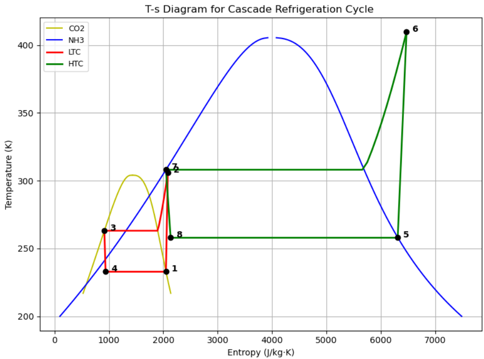
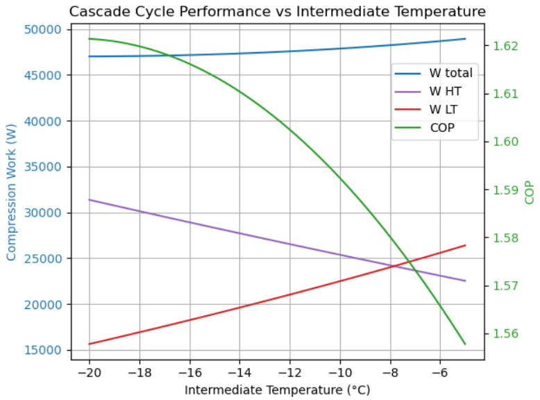
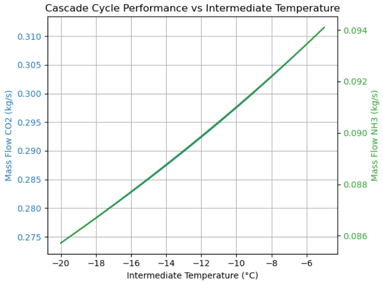
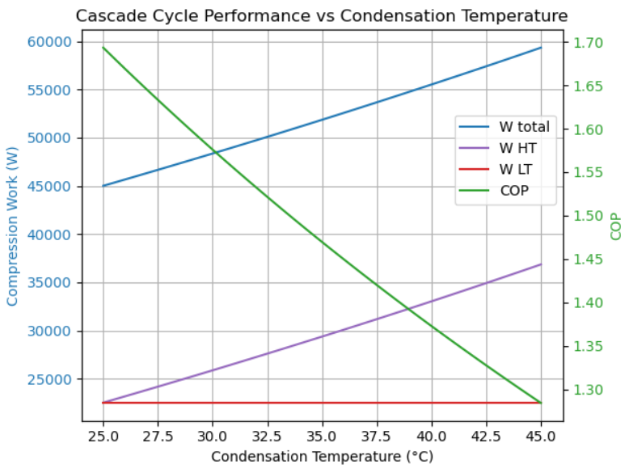
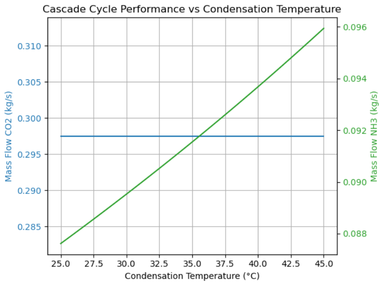
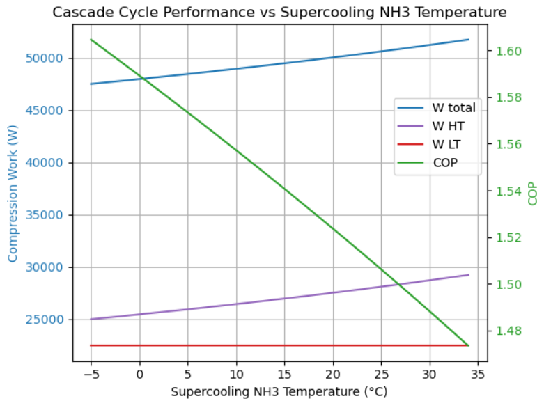
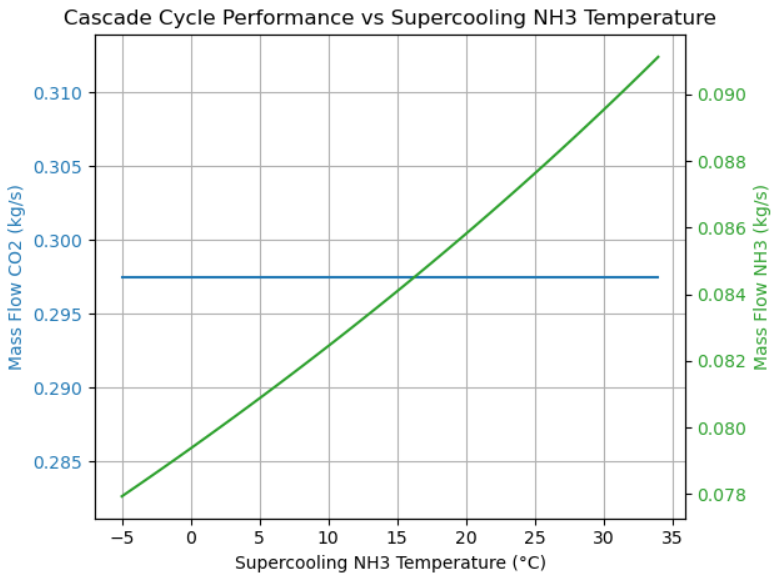

# 🧊 Parametric Study of a Cascade Refrigeration System Using NH₃ and CO₂

**Author:** Esteban Labrador de la Fuente  
**Date:** May 2025  
**Project Type:** Academic Thermodynamics Project  
**Tools & Methods:** CoolProp, Thermodynamic Modeling, T-s Diagrams, Parametric Analysis

---

## 📘 Overview

This project presents a detailed thermodynamic analysis and optimization of a **cascade refrigeration system** using **ammonia (NH₃)** and **carbon dioxide (CO₂)** as working fluids. The system is designed to efficiently achieve ultra-low temperatures (~−50°C), ideal for critical applications such as **pharmaceutical storage**, **deep freezing**, and **cryogenics**.

The cascade configuration isolates NH₃ to the high-temperature loop for safety while using CO₂ in the distribution side, combining high performance with safer and more environmentally friendly operation.

  

  <em>T-s diagram of the cascade refrigeration cycle using ammonia and CO₂.</em>

---

## 🔧 Objectives

- Analyze performance metrics (COP, compressor work, mass flow rate) for:
  - A simple NH₃ refrigeration cycle
  - A cascade NH₃-CO₂ refrigeration cycle
- Conduct **parametric studies** by varying:
  - Intermediate temperature
  - Condenser temperature
  - Evaporator temperature
  - Degree of supercooling and superheating

---

## 📊 Key Results

- **Baseline Performance:**
  - Simple NH₃ Cycle COP: **1.79**
  - Cascade System COP: **1.83** (slightly higher, with reduced compressor work)

- **Parametric Insights:**
  - **Lower intermediate temperatures** improve COP and reduce refrigerant flow rates.
  - **Supercooling NH₃** enhances performance.
  - **Superheating CO₂** decreases performance and increases energy input.
  - System performs better at **higher evaporation temperatures** and **lower condensation temperatures**.

---

## 📊 Figures that demonstrate Results

  
  

  <em>Effect of intermediate temperature on COP, compression work, and mass flow rates.</em>

  
  

  <em>Effect of condensation temperature on COP, compression work, and mass flow rates.</em>

  
  

  <em>Effect of supercooling NH₃ on COP, compression work, and mass flow rates.</em>

---

## 🌱 Sustainability

Both NH₃ and CO₂ are environmentally friendly refrigerants:
- **Zero ODP**
- **Very low GWP**

This system supports modern sustainability goals and safer refrigeration solutions.

---

## 📂 Full Report

[📄 Download PDF Report](./Project_Refrigeration_Cascade.pdf)

---

## 🔍 Future Work

- Experimental validation of modeled results
- Inclusion of pressure drops in piping and components
- Dynamic performance analysis under varying load conditions

---

## 📎 References

1. Refrigerated & Frozen Foods (2016). *Ammonia vs. ammonia/CO₂ cascade systems*  
2. Kasi, P., & Marimuthu, C. (2021). *Review of cascade refrigeration systems for vaccine storage* (J. Phys.: Conf. Ser., 2054)

---

> _This project demonstrates the feasibility and thermodynamic benefits of cascade refrigeration in ultra-low temperature applications. It also reflects my skills in thermal systems analysis, engineering modeling, and sustainable technology design._

# 🧊 Parametric Study of a Cascade Refrigeration System Using NH₃ and CO₂

**Author:** Esteban Labrador de la Fuente  
**Date:** May 2025  
**Project Type:** Academic Thermodynamics Project  

---

## 📘 Overview

This project presents a detailed thermodynamic analysis and optimization of a **cascade refrigeration system** using **ammonia (NH₃)** and **carbon dioxide (CO₂)** as working fluids. The system is designed to efficiently achieve ultra-low temperatures (~−50°C), making it ideal for **pharmaceutical storage**, **deep freezing**, and **cryogenic applications**.

The cascade configuration allows NH₃ to operate only in the high-temperature loop (for safety) while CO₂ handles the low-temperature distribution side. This setup provides an optimal balance between efficiency, safety, and environmental responsibility.

  

  <em>T-s diagram of the cascade refrigeration cycle using ammonia and CO₂.</em>

---

## 🔧 Objectives

- Compare performance metrics (COP, compressor work, mass flow rate) between:
  - A simple NH₃ refrigeration cycle
  - A cascade NH₃–CO₂ refrigeration cycle  
- Conduct a **parametric analysis** varying:
  - Intermediate temperature
  - Condenser temperature
  - Evaporator temperature
  - Degrees of supercooling and superheating

---

## ⚙️ Tools & Methods

- **CoolProp** was used for accurate thermophysical property calculations of NH₃ and CO₂.
- Thermodynamic modeling based on energy and entropy balances.
- Parametric sweeps carried out using Python.
- Visualized performance trends using COP, mass flow rate, and compression work.
- **T–s diagrams** created to visualize refrigeration cycles.

---

## 🔬 Results & Discussion

### 🔹 Baseline Performance

- Simple NH₃ Cycle COP: **1.79**  
- Cascade NH₃–CO₂ Cycle COP: **1.83**  
  _→ Slightly higher COP with reduced compressor work in the cascade configuration._

### 🔹 Parametric Insights

- **Lower intermediate temperatures** improve COP and reduce refrigerant mass flow rates.
- **Supercooling NH₃** significantly enhances system performance.
- **Superheating CO₂** reduces performance and increases energy input.
- System performs better at:
  - **Higher evaporation temperatures**
  - **Lower condensation temperatures**

---

### 📊 Key Figures

#### ➤ Intermediate Temperature Effects

  
  

  <em>Effect of intermediate temperature on COP, compression work, and mass flow rates.</em>

#### ➤ Condensation Temperature Effects

  
  

  <em>Effect of condensation temperature on COP, compression work, and mass flow rates.</em>

#### ➤ Supercooling Effects

  
  

  <em>Effect of supercooling NH₃ on COP, compression work, and mass flow rates.</em>

---

## 🌱 Sustainability Considerations

Both NH₃ and CO₂ are environmentally benign refrigerants:

- **Zero Ozone Depletion Potential (ODP)**
- **Very Low Global Warming Potential (GWP)**

This system supports modern sustainability goals for industrial and commercial refrigeration.

---

## 📂 Full Report

[📄 Download PDF Report](./Project_Refrigeration_Cascade.pdf)

---

## 🔍 Future Work

- Experimental validation of simulation results
- Include pressure drops and component efficiencies
- Dynamic simulation under variable load conditions

---

## 📎 References

1. Refrigerated & Frozen Foods (2016). *Ammonia vs. ammonia/CO₂ cascade systems*  
2. Kasi, P., & Marimuthu, C. (2021). *Review of cascade refrigeration systems for vaccine storage*. J. Phys.: Conf. Ser., 2054  
3. Bell, I. H., et al. (2014). *CoolProp: An open-source reference library for thermophysical properties*. Industrial & Engineering Chemistry Research.

---

> _This project demonstrates the feasibility and thermodynamic advantages of cascade refrigeration systems in ultra-low temperature applications. It reflects my skills in thermal system modeling, parametric optimization, and sustainable refrigeration design._

